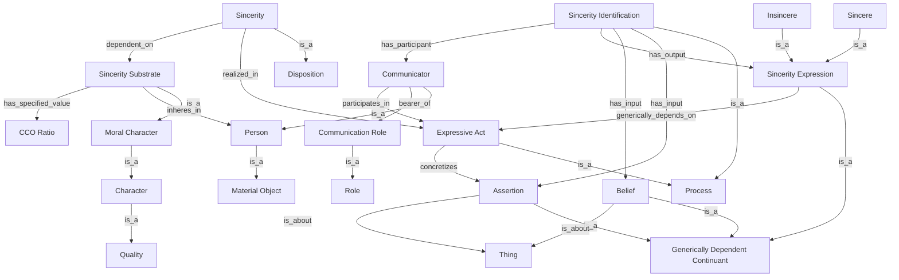

**Title:**
A Realist Ontological Model of Sincerity: A Prototype for Modeling Moral Character

**Authors:**
\[Author Name(s)]

**Abstract:**
This whitepaper presents an ontological model of "Sincerity" grounded in the Basic Formal Ontology (BFO) and Common Core Ontologies (CCO). It serves as a prototype for representing moral character within realist ontology frameworks. Sincerity, as a disposition realized in expressive acts and evaluable via information processing, is explored in detail. The model is then generalized into a blueprint for modeling other moral character traits, offering a philosophically grounded, interoperable structure for ethical discourse across belief systems. Illustrative examples and a mermaid diagram are included.

---

## 1. Introduction

Character is foundational to ethical reasoning, yet ontological representations of character remain underdeveloped, especially in systems that prioritize realism and formal rigor. This paper proposes an ontological model of **Sincerity** as a test case for modeling character traits within the Basic Formal Ontology (BFO) framework. Drawing on CCO patterns and rooted in realist philosophy, we demonstrate how sincerity can be modeled in a way that is both operationalizable and respectful of diverse philosophical traditions.

---

## 2. Philosophical Background

The concept of *sincerity* has been central in moral philosophy, particularly in virtue ethics (Aristotle), deontology (Kant), and existentialism (Sartre). Though defined differently across traditions, sincerity is generally understood as the congruence between internal belief and external expression.

A realist ontological model seeks to avoid encoding normative claims directly. Instead, it models the **structures of reality** that underlie ethical evaluations, providing a common representational framework without asserting universal moral truths. In this way, ontologies can mediate between diverse value systems.

---

## 3. The Sincerity Model

### 3.1 Overview

The Sincerity model leverages BFO and CCO to capture the following pattern:

* A **disposition** (`sincerity`) that is dependent upon a **quality** (`sinceritySubstrate`)
* Both inhere in a **person**
* The disposition is **realized in** an **expressive act**
* The act **concretizes** an **assertion** (an **information content entity**)
* A separate **belief** (another **information content entity**) is held by the person
* An **information processing** activity compares belief and assertion
* The result is a **sincerity expression** (e.g., "sincere" or "insincere")

### 3.2 BFO-Aligned Definitions

| Term                         | Definition                                                                                                       | BFO Class                  |
| ---------------------------- | ---------------------------------------------------------------------------------------------------------------- | -------------------------- |
| **Sincerity**                | A disposition to express beliefs congruently through expressive acts.                                            | Disposition                |
| **Sincerity Substrate**      | A moral quality inhering in a person which serves as the basis for the sincerity disposition.                    | Quality                    |
| **Sincerity Ratio**          | A generically dependent continuant representing a scalar degree of sincerity derived from a measurement process. | GDC                        |
| **Sincerity Identification** | An information processing activity that evaluates congruence between belief and assertion.                       | Process                    |
| **Assertion**                | An information content entity representing a truth-claim.                                                        | Information Content Entity |
| **Belief**                   | An information content entity held by a person, representing their internal position on a subject.               | Information Content Entity |
| **Expressive Act**           | A process in which a person externalizes an assertion, verbally or nonverbally.                                  | Process                    |
| **Communicator**             | A material object (typically a person) bearing the role of expressing symbolic content.                          | Material Object            |
| **Communication Role**       | A role borne by a communicator during expressive acts.                                                           | Role                       |
| **Sincerity Expression**     | A symbolic representation or judgment of whether an act was sincere.                                             | GDC                        |

### 3.3 Key Relations

* `sinceritySubstrate` **inhere\_in** `person`
* `sincerity` **dependent\_on** `sinceritySubstrate`
* `sincerity` **realized\_in** `expressive act`
* `expressive act` **concretizes** `assertion`
* `assertion` **is\_about** `thing`
* `belief` **is\_about** `thing`
* `sincerityIdentification` **has\_input** `assertion`, `belief`
* `sincerityIdentification` **has\_output** `sincerityExpression`
* `communicator` **participates\_in** `expressive act`
* `communicator` **bearer\_of** `communicationRole`
* `sinceritySubstrate` **has\_specified\_value** `sincerityRatio`

### 3.4 Mermaid Diagram

### 3.5 Illustrative Example

**Example:** Alice is asked if she enjoyed a dinner her friend cooked. Internally, she believes the food was poorly made (belief). However, she smiles and says "It was great!" (assertion in expressive act). An observer or system compares her assertion to her belief (sincerity identification). The result is an insincere judgment (sincerity expression).

---

## 4. Generalizing the Model to Moral Character

Moral character traits like honesty, courage, humility, and empathy can be modeled similarly:

* Each trait is a **disposition** that may depend on a supporting **quality**
* Manifesting in certain **expressive or behavioral processes**
* Measurable via **information processing** activities
* Resulting in **representations** of character expression

This structure supports formalization of character traits without encoding subjective value systems, enabling ethical AI, interfaith dialogue, and character-driven knowledge representation.

---

## 5. Applications and Implications

### 5.1 Ethical AI

Machine agents can use sincerity evaluations to determine trustworthiness, manage dialogue states, and adjust behavior.

### 5.2 Interoperability Across Worldviews

By modeling *how* character manifests (not *whether it is good*), the model provides a shared representational framework for religious, philosophical, and secular ethical systems.

### 5.3 Cognitive and Psychological Research

The model aligns with dual-process theories of cognition and moral psychology by separating dispositional structures from contextual realization.

---

## 6. Conclusion

The Sincerity model provides a formally grounded, realist ontology for character modeling. By representing character traits as dispositions realized in expressive acts and evaluated via comparison to internal states, this approach supports ethical discourse, semantic interoperability, and principled AI development. As a general prototype, it offers a scaffold for modeling the broader domain of moral character.

---

## 7. References

* Arp, R., Smith, B., & Spear, A. D. (2015). *Building Ontologies with Basic Formal Ontology.* MIT Press.
* Kant, I. (1785). *Groundwork of the Metaphysics of Morals.*
* Aristotle. *Nicomachean Ethics.*
* Common Core Ontologies: [https://www.commoncoreontology.org](https://www.commoncoreontology.org)
* BFO 2020 Specification: [https://basic-formal-ontology.org](https://basic-formal-ontology.org)

---

*Contact: \[Your Name, Institution, Contact Info]*
