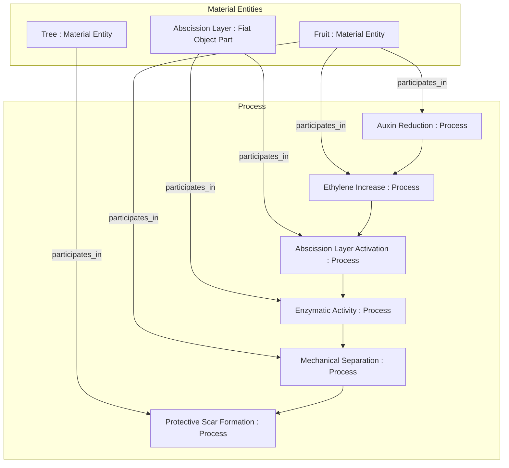
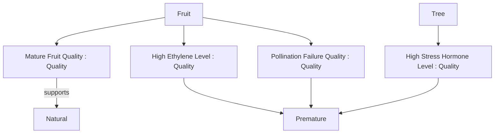
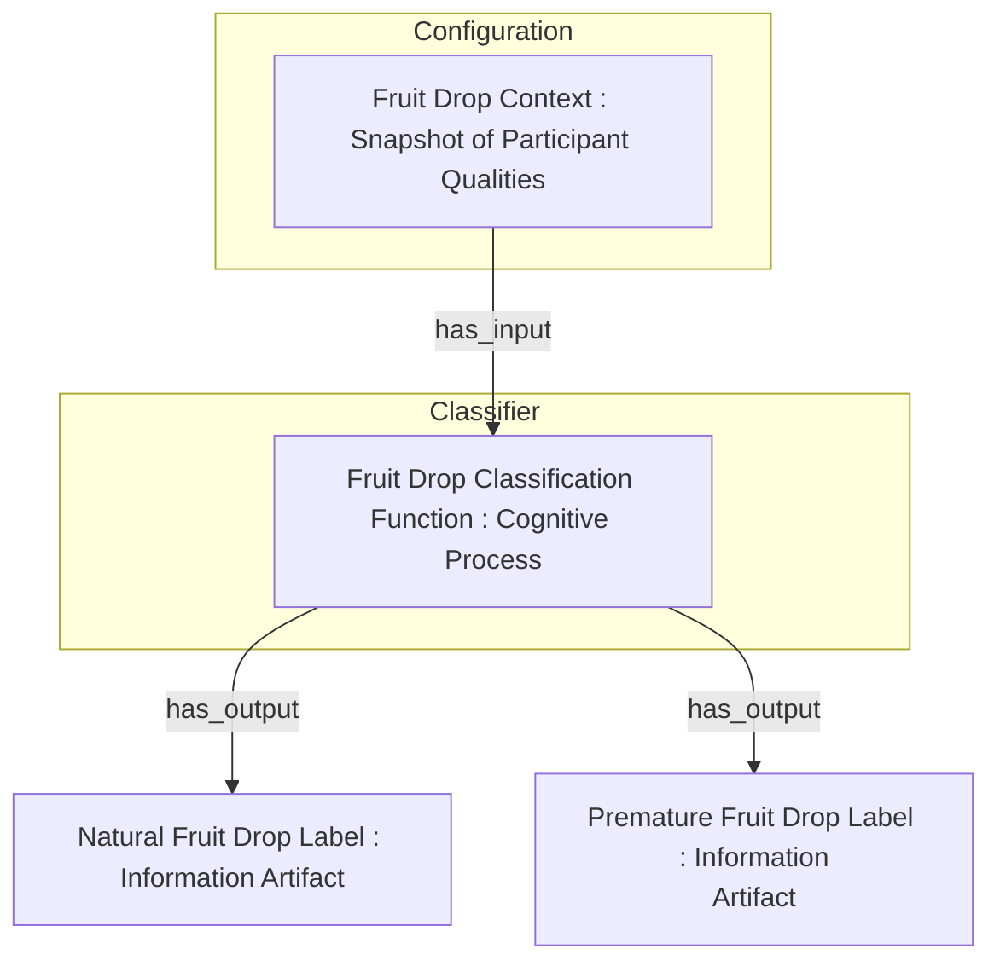
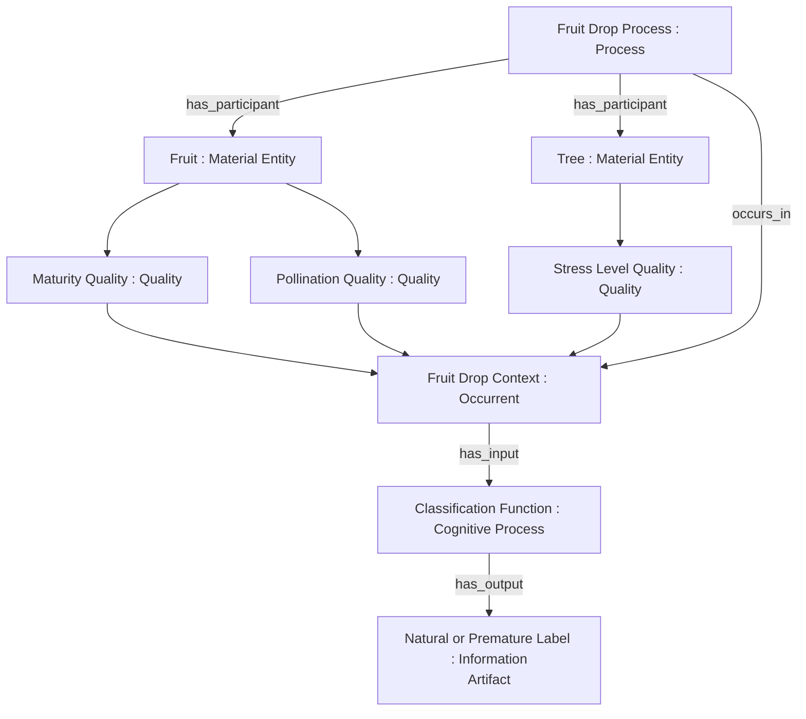
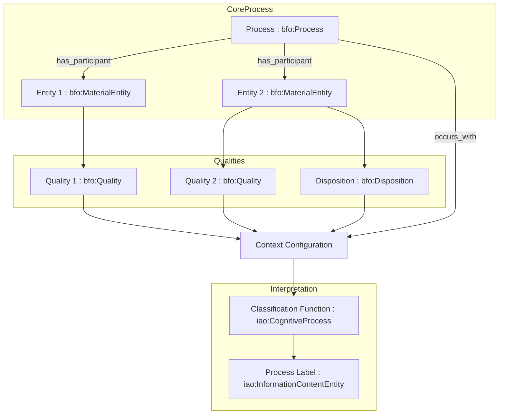

# Reclaiming Process Semantics in Realist Ontology: A BFO-Aligned Proposal
for Human-Centric Classification of Biological Events
**Abstract**
While the Basic Formal Ontology (BFO) offers a robust realist framework for
modeling biomedical and biological domains, practical modeling often reveals
tensions between BFO’s ontological rigor and human-centered, domain-specific
classifications. This paper addresses one such challenge: the folk-biological
distinction between “natural” and “premature” fruit drop. We demonstrate that
while these are not ontologically distinct process types under BFO, they can
be meaningfully modeled through configurations of participant qualities and
dispositions. We propose a BFO-consistent pattern that preserves ontological
realism while effectively supporting human-interpretable classification of
processes and discuss its implications for knowledge representation.
## 1. Introduction
In biological and agricultural domains, humans routinely classify processes
based on their perceived normalcy or deviation. A common example is the
distinction between natural and premature fruit drop:
* **Natural fruit drop** is understood as an integral part of the normal
maturation and reproductive cycle of a plant.
* **Premature fruit drop** is perceived as a pathological or stress-induced
deviation from this normal cycle.
These labels strongly imply different process *types* in everyday language
and domain-specific discourse. However, under a strict realist ontology like
BFO, both are realizations of the same fundamental ontological process class:
a fruit detaching from a tree. The tension arises from the necessity to
reconcile these realist ontological commitments with the pragmatic
classification schemes prevalent in scientific and agricultural communication
and knowledge organization.

**Human Significance and Ontological Realism**

The ability to distinguish between “natural” and “premature” fruit drop is not a trivial semantic exercise—it is critical to both the economic stability of agricultural industries and, in many regions, to food security and human survival. Farmers, ecologists, and agronomists must detect deviations from expected developmental cycles to diagnose plant health, mitigate crop loss, and ensure productive yields. These distinctions reflect genuine regularities in the world, even if they do not correspond to distinct ontological process types. A realist ontology must therefore be capable of grounding these human-pragmatic classifications in actual configurations of qualities and dispositions. Only then can it serve both as a faithful model of reality and as a tool for meaningful human application.
## 2. The Ontological Challenge
BFO provides a clear and rigorous framework for distinguishing between
different types of entities:
* **Occurrents:** Entities that have temporal parts and unfold in time, such
as a fruit drop process.
* **Continuants:** Entities that persist through time while maintaining their
identity, such as a fruit or a tree.
* **Dependent continuants:** Entities that inhere in and are dependent on
continuants, including qualities (e.g., color, size) and dispositions (e.g.,
fragility, susceptibility to disease).
The core ontological challenge we address is that human classification of
processes often relies heavily on the *context* in which they occur,
particularly the states and qualities of the participating entities, rather
than on fundamental differences in the process itself.
Attempting to directly ontologize these folk distinctions would lead to
problems:

* “Natural Fruit Drop” and “Premature Fruit Drop” would incorrectly be
represented as distinct subclasses of `Fruit Drop Process`.
* This would violate the realist principle that processes are individuated by
what they fundamentally *are* (a specific sequence of events involving
particular participants), not by how humans interpret or categorize them
based on associated circumstances.
## 3. Decomposing the Fruit Drop Process
To establish a BFO-consistent foundation, let us first model the core fruit
drop process, irrespective of human-imposed semantics:

In this model, the Fruit Drop Process is understood as an aggregate of temporally related
subprocesses, involving specific participants (the fruit, the tree, and the abscission layer). The
level of granularity chosen here focuses on the key biological events leading to detachment and
subsequent protective measures. Other more granular or higher-level processes could also be
considered, but these represent the core sequence relevant to our distinction.
## 4. Adding Qualities and Dispositions
The crucial insight for resolving the tension lies in recognizing that the perceived difference
between &quot;normal&quot; and &quot;premature&quot; fruit drop is not rooted in distinct process kinds but rather in
differing states and qualities of the entities participating in that single process kind. These
qualities influence the unfolding and the perceived normalcy of the fruit drop event:

These qualities are modeled as dependent continuants that inheres_in the respective material
entities (fruit and tree). They are conferred_by various underlying biological and environmental
processes (not explicitly modeled here for brevity). For instance, maturity is conferred by
developmental processes, while high stress hormone levels can be conferred by environmental
stressors like drought or pest infestation.
## 5. Modeling Human Classification as an Information
Artifact
To reconcile this realist ontological model with human classification practices, we propose
modeling the classification itself not as an ontological distinction in the process, but as a
cognitive and informational process that results in an information artifact: a label.

Here, the Fruit Drop Context is conceived as a specific configuration of the relevant qualities
of the participating entities at or leading up to the fruit drop event. This &quot;snapshot&quot; represents a
specific instantiation of the qualities discussed in the previous section and can be considered an
occurrent (a specific state of affairs at a given time). The Fruit Drop Classification
Function represents the cognitive process (or potentially an automated algorithm) that takes this
context as input and outputs a classification label (&quot;Natural Fruit Drop&quot; or &quot;Premature Fruit
Drop&quot;), which is an Information Artifact.
## 6. Final BFO-Aligned Model
Integrating these components yields the following BFO-aligned model:


In this comprehensive model:
* The Fruit Drop Process remains a single ontological kind, characterized by its
constituent subprocesses and participating entities.
* The specific configuration of relevant Quality instances (Maturity
Quality, Pollination Quality, Stress Level Quality) at the time of the event
constitutes the Fruit Drop Context.
* This Fruit Drop Context (occurs_in the process or is the immediate background
against which it unfolds) serves as the input to a Classification Function.
* The Classification Function outputs an Information Artifact – the &quot;Natural&quot; or
&quot;Premature&quot; label – reflecting human interpretation based on the contextual factors.
This approach explicitly acknowledges that the classification is a secondary process of
interpretation and labeling, not an inherent difference in the fundamental ontological nature of
the fruit drop event itself.
## 7. Benefits of the Approach
This BFO-aligned model offers several key benefits:
* Maintains Realist Discipline: It avoids introducing false ontological distinctions based
on human interpretation, adhering to the principle that processes are individuated by their
intrinsic nature.
* Supports Domain Needs: It effectively accommodates human classification needs and
semantic distinctions used in scientific and agricultural discourse by modeling these as
arising from contextual factors and interpretive processes.
* Extensible: This pattern can be readily extended to other domains (e.g., medical
diagnoses of &quot;normal&quot; vs. &quot;pathological&quot; physiological processes, environmental
classifications of &quot;natural&quot; vs. &quot;anthropogenic&quot; events, or even sociotechnical systems
where human actions are classified based on context) where similar tensions between
ontological reality and human categorization exist.

* Enhanced Knowledge Representation: By explicitly separating the ontological process
from its human classification, this model allows for more accurate and flexible
knowledge representation. Queries can focus on the fundamental process while still
allowing for filtering and categorization based on the relevant contextual qualities and
their associated labels. This can improve reasoning and data integration across different
datasets that might use different labeling conventions.

## 8. Modeling Realist-Compatible Interpretive Categories in RDF Using Equivalent Classes
In a realist ontology, particularly one aligned with Basic Formal Ontology (BFO), processes are individuated by their inherent causal structure and participants—not by how humans interpret or categorize them. Consequently, categorizations like "natural" or "premature" should not be modeled as subclasses of the process itself (e.g., FruitDropProcess). Doing so would improperly reify cognitive interpretations as ontological distinctions in reality.

Instead, we preserve realist commitments while enabling automated classification by representing these interpretations as Information Content Entities (ICEs). These ICEs are not processes themselves, but descriptions about processes, allowing us to maintain the ontological integrity of the domain while still enabling inferencing.

**Equivalent Class Design Pattern**

To achieve this, we define NaturalFruitDrop and PrematureFruitDrop as subclasses of cco:InformationContentEntity, and use owl:equivalentClass to specify logical conditions under which an ICE refers to a particular type of fruit drop process.

For example:
```
:NaturalFruitDrop rdf:type owl:Class ;
    rdfs:subClassOf cco:InformationContentEntity ;
    owl:equivalentClass [
        rdf:type owl:Class ;
        owl:intersectionOf (
            cco:InformationContentEntity
            [ owl:Restriction ;
              owl:onProperty cco:isAbout ;
              owl:someValuesFrom [
                  owl:Class ;
                  owl:intersectionOf (
                      :FruitDropProcess
                      [ owl:Restriction ;
                        owl:onProperty :hasParticipant ;
                        owl:someValuesFrom [
                            owl:Restriction ;
                            owl:onProperty :hasQuality ;
                            owl:hasValue :MatureFruit
                        ]
                      ]
                  )
              ]
            ]
        )
    ] .
```
This pattern allows a reasoner (e.g., HermiT, Pellet) to automatically classify a particular ICE as :NaturalFruitDrop or :PrematureFruitDrop based on the structure of the process it is about and the qualities of its participants.

Enabling Realized Cognitive Processes via Reasoners
In this model, cognitive processes—the human recognition and naming of natural kinds—are simulated through logical inference. A reasoner performs a role analogous to cognitive pattern recognition: inferring that a certain configuration of qualities (e.g., a process involving a mature fruit falling) corresponds to a specific interpretive category (e.g., natural fruit drop).

This separation of process from interpretation is vital for building semantic systems that are both realist-compliant and epistemically useful. It supports the long-term goal of modeling how humans (or machines) classify reality without conflating ontological and epistemological layers.

Once the reasoner runs over these triples, it will infer additional relationships based on the logic defined by the owl:equivalentClass and rdf:type axioms. Here's what the resulting triples might look like for your example:

Starting Triples
```
:FruitDropProcess rdf:type owl:Class ;
    rdfs:subClassOf bfo:Process .

:FruitDropProcess_123 rdf:type :FruitDropProcess ;
    :hasParticipant :Fruit456 .

:Fruit456 rdf:type :Fruit ;
    :hasQuality :MatureFruit .
```
**Reasoner Inferences**

The reasoner will infer that :FruitDropProcess_123 involves a fruit with a particular quality (:MatureFruit).

Based on the logic for :NaturalFruitDrop, the reasoner will classify the :FruitDropProcess_123 as being associated with a natural fruit drop (since :Fruit456 has the :MatureFruit quality).

Resulting Triples After Reasoning
```
:FruitDropProcess rdf:type owl:Class ;
    rdfs:subClassOf bfo:Process .

:FruitDropProcess_123 rdf:type :FruitDropProcess ;
    :hasParticipant :Fruit456 ;
    rdf:type :NaturalFruitDrop .

:Fruit456 rdf:type :Fruit ;
    :hasQuality :MatureFruit .
```
**Explanation of the Inferences**

New Triple for Classification: :FruitDropProcess_123 rdf:type :NaturalFruitDrop .
This indicates that the reasoner classified the :FruitDropProcess_123 as a :NaturalFruitDrop, based on the presence of the :MatureFruit quality.

Definition of Natural Fruit Drop: The reasoner also infers that the :NaturalFruitDrop is an instance of cco:InformationContentEntity, which is the class that holds interpretive categories about the process, without being a subclass of the process itself.

In this approach, the :NaturalFruitDrop class is an InformationContentEntity that reflects an interpretive category about a fruit drop process, not an ontologically distinct process type. The reasoner recognizes this interpretation based on the configured qualities (:MatureFruit in this case) linked to the fruit involved in the process.

## 9. Conclusion
Realist ontologies like BFO provide a powerful foundation for modeling the complexities of the
life sciences. However, effective application requires careful consideration of how human
conceptual systems interact with this underlying reality. Our proposed model offers a principled
approach to handling context-sensitive process classification by grounding the ontological
representation in BFO’s rigorous framework while explicitly modeling human interpretation as a
separate, information-generating process based on participant qualities and their configurations.
This balance between ontological realism and pragmatic semantic needs is crucial for building
robust and interoperable ontology-based knowledge systems in the life sciences and beyond.
References

**Generalization of the Approach**
While we have focused on fruit drop as a motivating example, the proposed pattern is broadly applicable. Any process whose classification depends on the qualitative state of its participants—whether in medicine, ecology, engineering, or social systems—can be modeled using this same realist-aligned pattern. By distinguishing the core occurrent from the contextual configuration of participant qualities, and modeling classification as an information artifact derived from that context, we preserve ontological clarity while supporting domain-specific semantics. This framework offers a scalable and principled way to integrate human interpretation with ontological realism.



* Smith, B., Ceusters, W., Klagges, B., Köhler, J., Kumar, A., Lomax, J., ... &amp; Rosse, C.
(2005). Relations in biomedical ontologies. Genome Biology, 6(5), R46.  1    

* Grenon, P., &amp; Smith, B. (2004). SNAP and SPAN: Towards Dynamic Spatial
Ontology. Spatial Cognition &amp; Computation, 4(1), 69–103.
* Arp, R., Smith, B., &amp; Spear, A. D. (2015). Building Ontologies with Basic Formal
Ontology. MIT Press.
